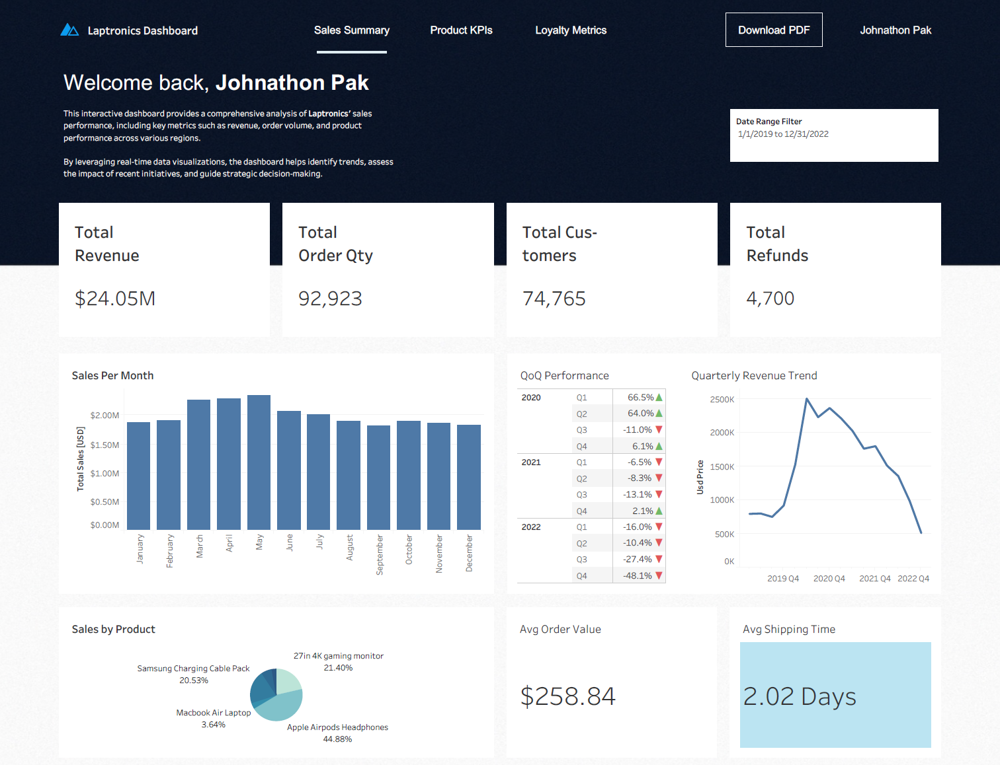

# Laptronics Analysis 2019 - 2022

## Project Background
As part of Laptronics' data analytics team, I was tasked with conducting in-depth analysis on various aspects of the company's sales performance, product-level metrics, and the impact of the newly launched loyalty program. The goal was to derive actionable insights that could guide strategic decisions, improve sales performance, and assess the success of recent marketing initiatives.

**Sales Trends Analysis**
- Evaluate historical sales patterns at a global and regional level.
- Visualize on revenue, order volume, and order value to identify key drivers of performance.

**Product Level Performance Analysis**
- Perform detailed analysis on Laptronics’ product lines to understand their impact on sales.
- Evaluate the performance of products in terms of both sales and returns to determine profitability.

**Loyalty Program Marketing Assessment**
- Assess the effectiveness of Laptronics’ recently launched loyalty program.
- Measure its impact on sales and customer retention, identifying patterns and recommendations for improving customer engagement.

## Data Structure, Cleanup, and EDA

You can access the database used in this project via [this BigQuery Dataset](https://console.cloud.google.com/bigquery?ws=!1m4!1m3!3m2!1sdata-analysis-projects-456521!2slaptronics_data) to explore the data and replicate the analysis.

SQL Queries performed to clean `geo_location` table can be [found here](code/geo_location_cleanup.sql)

SQL Queries performed to clean and analyze `orders_raw` can be [found here](code/orders_cleanup.sql)

## Executive Summary

Interactive Tableau Dashboard can be [found here](https://public.tableau.com/views/LaptronicsAnalysis/Dashboard1?:language=en-US&:sid=&:redirect=auth&:display_count=n&:origin=viz_share_link).
### Overview of Findings

**Laptronics Sales Trends**

- Our sale's have **peaked in 2020Q2 with a revenue of $2.5M**. This corresponds with the worldwide economic recovery from the pandemic in 2019.
- Beginning in 2021Q1 and onwards, revenue declined on a quarter-over-quarter basis for 8 quarters in a row. **Revenue hit a company lifetime low in 2022Q4 with a revenue of $509,918**.
- Interestingly, average order value (AOV) stayed fairly consistent, **ranging between $215 and $275**, indicating a fairly fixed product mix and pricing structure. However, sudden dips or spikes in AOV within specific months may be due to major product launches or temporary discounting strategies.

**Product-Level Performance Analysis**

- **86.81% of the orders are from just three products**. The **best-performing product in terms of total sales was the Gaming Monitor**, with over $8.3M in revenue and relatively low refund rates (~6%). **Apple Airpods Headphones** followed, showing strong volume and revenue but slightly higher refund activity (~5.5%), potentially due to customer dissatisfaction or quality control variance. Lastly, **Macbook Air Laptop** had a large part of the revenue but low amount of orders for it, due to it's large price. 
- High-value items such as the **MacBook Air and ThinkPad Laptop drove significant revenue but also showed above-average refund rates (~12%)**, flagging them as products with potential fulfillment or expectation mismatch issues. In contrast, low-cost accessories like Samsung charging cables had extremely low refund rates and high volume, making them reliable profit drivers despite their small per-unit margin.
- In the headphones category, the **Bose headphones significantly underperformed, contributing to less than 1% of total revenue**, despite being $40 cheaper than the Apple Airpods, which is the second best performing product at $6.6M.

**Loyalty Program Marketing Assessment**

- Despite a large portion of the customer base enrolling in the loyalty program, its effect on repeat purchasing has been limited. Customer retention: Loyalty members have lower repeat purchase rates so far than non-members. **Only about 0.1% of loyalty program customers placed more than one order during the analysis period, compared to roughly 8% of non-loyalty customers who made repeat purchases.**
- Loyalty members also spent less per order on average than others. Their **average order value was about $240, versus approximately $273 for non-members**. In aggregate, loyalty program members contributed around 39% of total revenue (despite being ~45% of customers), reflecting their lower spend per purchase.
- Loyalty members’ share of total orders by year. The program saw rapid adoption – loyalty members accounted for only ~11% of orders in 2019, rising to ~55% by 2021. However, this growth plateaued in 2022 (loyalty members were ~52% of orders), suggesting that new member sign-ups and participation leveled off. While nearly half of transactions now come from loyalty program customers, this alone has not yet translated into superior retention or spend per customer.

## Recommendations and Next Steps
After a comprehensive analysis of Laptronics’ sales data, product performance, and customer behavior, three overarching themes emerged that guide our forward-looking strategy:

### 1. Capitalize on Seasonal Peaks & Mid-Year Gaps
- **Double down on Q4 promotions:** Develop targeted, tiered campaigns leading into November, possibly using early access incentives for loyalty members. Consider bundling high-margin accessories to increase AOV during the seasonal rush.
- **Boost mid-year campaigns:** Introduce thematic or event-based promotions (e.g., back-to-school, summer sales) around underperforming months like February and July to smooth revenue distribution.

### 2. Optimize Product Portfolio for Profitability & Satisfaction
- **Expand successful product lines:** Consider expanding the product family of top sellers like monitors and headphones (e.g., new sizes or bundles) to build on existing demand.
- **Review high-return SKUs:** Conduct a qualitative review (e.g., customer reviews or NPS) on high-value, high-return products to identify issues—whether it's product quality, delivery expectations, or mismatched advertising.

### 3. Revamp Loyalty Program for Real Retention
- **Reduce friction in the loyalty experience:** Simplify and streamline how customers earn and redeem rewards. Make sure using the program is effortless – for instance, auto-applying points or discounts and minimizing any hassle in the checkout or reward redemption process.
- **Personalize member engagement:** Move beyond one-size-fits-all promotions by leveraging customer data to deliver segmented, targeted offers to loyalty members. Tailored rewards (such as discounts on categories a customer has shown interest in) and personalized communications can significantly boost engagement.
- **Encourage early reward redemption:** Structure the program so that customers can earn and redeem a reward within their first few purchases. Experiencing a benefit early on can hook customers into coming back. Offering attainable rewards (e.g. a small free accessory or discount on the next purchase) will give new members a tangible reason to make a follow-up purchase and keep engaging with the program.

## Closing Thoughts
This analysis was conducted to support Laptronics in understanding the key drivers of its sales performance, customer retention, and product-level profitability. By integrating order history with customer-level data, we were able to uncover actionable insights across multiple facets of the business. The findings highlight both clear strengths, such as seasonal sales momentum and high-performing accessories, as well as opportunities to address areas like product return rates and loyalty program underperformance.

The goal of this work was not just to report on what happened, but to recommend specific, data-informed next steps that can drive long-term value. Improving customer retention, optimizing product offerings, and unlocking new growth periods outside of Q4 will require ongoing iteration, but the foundation has now been laid with a clear direction and performance baselines. With continued investment in data-driven experimentation and personalization, Laptronics can evolve from a transactional retailer into a more customer-centric and resilient business.

